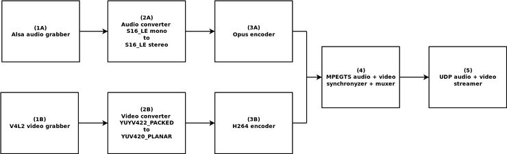
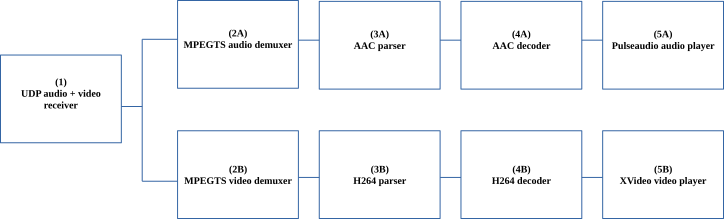

# Optimum Latency Streaming System

## ABOUT

An experimental **UDP** audio (**AAC**)+ video (**H264**) streaming system (streaming server + client player) with the lowest possible latency, based on LAAV and a patched version of Gstreamer.
The system is composed as follows:

**Streaming server**:

* All the modules, except (3A) and (4), do not introduce significant latency.
* Module (3A) (AAC encoder) requires a minimum latency of two frames (according to AAC specifications), which is printed as output by the streamer and is reflected on video latency due to the synchronization made by the module (4). It is minimized by selecting the highest sampling rate (in this case 44100, corresponding to ~45 ms overall latency).
* Module (4) introduces 1 frame latency, which can be eliminated by installing ffmpeg with the patch included in patches/ffmpeg-3.2.4/libavformat/mpegtsenc.c

**Client player**:

* Module (4A) does not introduce significant latency.
* Module's (1) latency depends on the network latency/jitter. It is suggested to do preliminary tests with both player and streamer on localhost, so to avoid this latency. Note that the player ensures that (1) starts to push frames to (2A) and (2B) only when a first PCR is obtained.
* Module (4B) introduces latency, here eliminated by setting the "max-threads = 1" property on the gstreamer decoder.
* Each of the modules (2A), (2B), (3A), (3B) introduces the latency of 1 frame that can be eliminated by installing gst-plugins-bad-1.12.3 and gst-plugins-good-1.12-3 with their respective patches included in patches/gst-plugins-bad-1.12.3 and patches/gst-plugins-good-1.12.3; in addition, a PAT/PMT is sent for each muxed frame, on the streamer's muxer (4), in order to avoid further latency introduced by modules (2A) and (2B) when starting to parse the MPEGTS stream (not sure if it's necessary. Anyway: see the macro PAT_PMT_AT_FRAMES in FFMPEGMuxer.hpp).
* Latencies introduced by (5A) and (5B) are minimized through the properties: buffer-time + latency-time (5A) and max-lateness (5B) on the gstreamer corresponding elements.

The system is based on the idea that audio/video synchronization is performed on the server side and avoids using the synchronizer provided by gstreamer, which introduces a latency that is hard to eliminate. In order to avoid the above mentioned synchronizer, two different MPEGTS demuxers are used, one for the audio pipe and one for the video pipe, corresponding to two independent threads on the player.

The system is strictly experimental, not fully tested and, for the moment, requires complex installation: please help me to simplify it by creating three gstreamer plugins (they will be called "tsdemux-laav", "aacparse-laav" and "h264parse-laav" from the patches I've included here ) so you do not have to re-install gst-plugins-bad and gst-plugins-good; I don't have any idea, for the moment, about how to simplify the ffmpeg patch in the installation.

Tests must be performed with a video source with a framerate of at least 25fps and an audio source with a sampling rate of 44100. Write me an-email (see the email address in github) if you need additional help.

As said before, it is suggested to perform tests by launching both player and streamer on localhost, comparing the encoding date of each audio and video frame, printed as output, with that of the same frame, demuxed and decoded, provided by the player.

You can also modify the system by creating a HTTP (instead of UDP) streamer, with low latency as well, by compiling the LAAV library with the TCP_NODELAY macro (see where it is defined in EventsManager.hpp).

Due to the complexity of the project, any help/feedback is GREATLY appreciated!

## COMPILING 

* Required: gstreamer-1.12.3, gst-plugins-bad-1.12.3 (with the patches included patches/gst-plugins-bad-1.12.3), gst-plugins-good-1.12.3 (with the patch included patches/gst-plugins-good-1.12.3), gst-plugins-base-1.12.3, gst-libav-1.12.3, ffmpeg-3.2.4 (with the patch included patches/ffmpeg-3.2.4).

Be sure that ALL the gstreamer modules required by the player are properly installed (you can check that with gst-inspect-1.0 module-name): udpsrc, appsink, appsrc, tsdemux, aacparse, avdec_aac, pulsesink, h264parse, avdec_h264, xvimagesink.
* Execute: ./Compile

## RUNNING

Execute:
* (Streaming server)
./OptimumLatencyStreamer
* (Client player)
./OptimumLatencyPlayer alsa-device-identifier[i.e: plughw:U0x46d0x819] /path/to/v4l/device receiver_address
